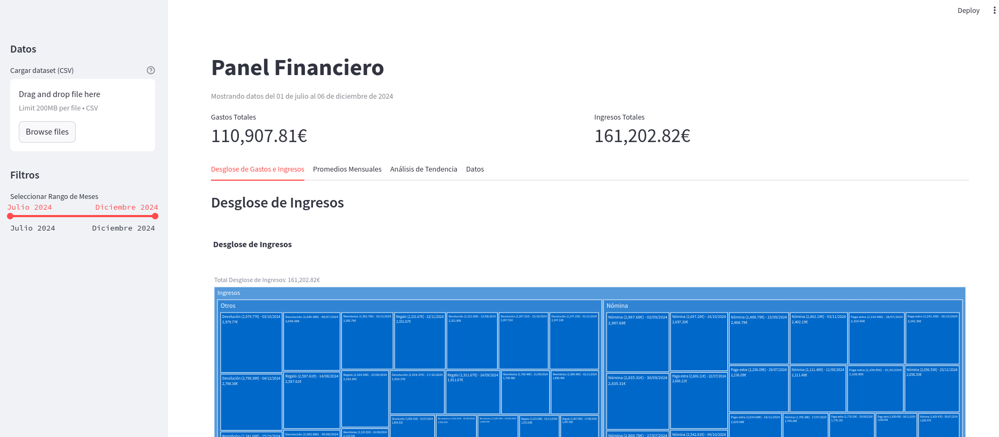
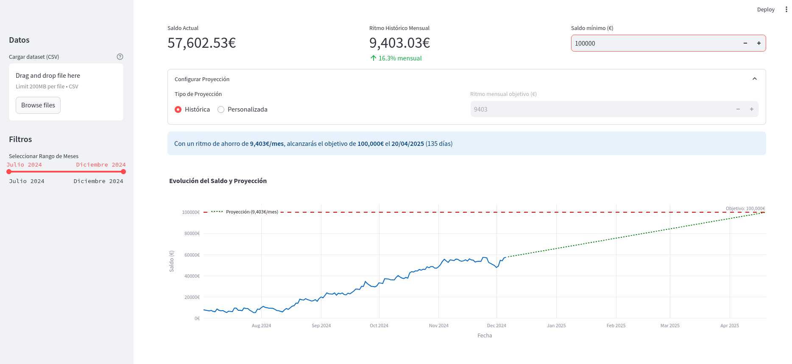
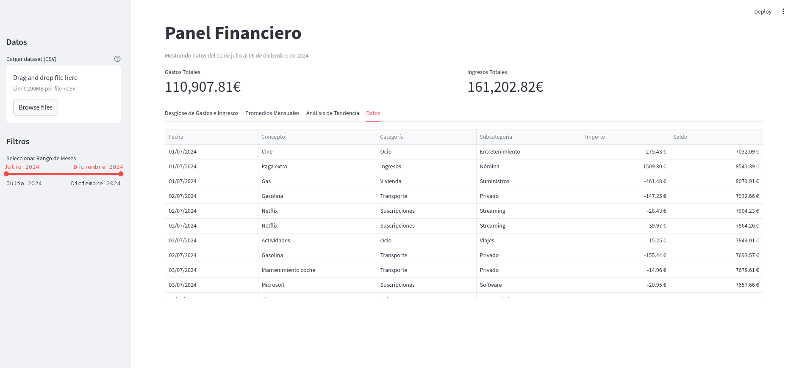

# Personal Finance Dashboard

A comprehensive financial analysis dashboard built with Streamlit that helps you visualize and understand your personal finances.

## Features

- 📊 Interactive visualizations of income and expenses
- 💰 KPI tracking for total income and expenses
- 🌳 Hierarchical treemaps for expense and income breakdown
- 📈 Balance trend analysis with future projections
- 📅 Monthly average spending analysis
- 🔍 Customizable date range filters
- 📑 Detailed transaction data grid

## Screenshots

### Dashboard Overview


### Expense Analysis


### Transaction Details


## Installation

1. Clone the repository
2. Install dependencies using Poetry:

```bash
poetry install
```

## Usage

1. Prepare your financial data in CSV format with the following columns:
   - Fecha (Date)
   - Concepto (Description)
   - Category
   - Subcategory
   - Importe (Amount)
   - Saldo (Balance)

2. Run the dashboard:

```bash
poetry run streamlit run finanzas/dashboard.py
```

3. Upload your CSV file through the sidebar or use the demo dataset

## Development

### Generate Demo Data

To generate fake data for testing:

```bash
poetry run python finanzas/gendata.py
```

This will create a `fake_dataset.csv` in the `data` directory with 6 months of sample transactions.

### Code Quality

The project uses:
- mypy for type checking
- ruff for linting and formatting

Run checks with:

```bash
poetry run mypy .
poetry run ruff check .
poetry run ruff format .
```

## Dependencies

- Python 3.10+
- Streamlit
- Pandas
- Plotly
- NumPy
- Matplotlib
- Seaborn

For a complete list of dependencies, see the `pyproject.toml` file.

## License

This project is licensed under the MIT License - see the LICENSE file for details.
